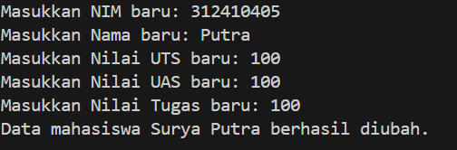

# TUGAS PRAKTIKUM 6

## Step 1 : List

Fungsi: Sebagai tempat penyimpanan data mahasiswa. Data disimpan dalam bentuk list yang berisi dictionary, di mana setiap dictionary merepresentasikan satu mahasiswa.

## Step 2 : Fungsi Tambah()

Apa yang dilakukan:
1. Meminta input NIM, nama, nilai UTS, UAS, dan tugas dari pengguna.
2. Menghitung nilai akhir sebagai rata-rata tiga nilai.
3. Membuat dictionary berisi data mahasiswa dan menyimpannya ke dalam data_mahasiswa dengan append().
* Output: Konfirmasi bahwa data mahasiswa telah berhasil ditambahkan.

## Step 3 : Fungsi Tampilkan()

Apa yang dilakukan:
1. Mengecek apakah data_mahasiswa kosong. Jika iya, tampilkan pesan "Belum ada data".
2. Jika ada data, tampilkan seluruh data mahasiswa dalam format tabel dengan kolom:
NIM, Nama, UTS, UAS, Tugas, Akhir.
* Output: Tabel berisi data mahasiswa.

## Step 4 : Fungsi hapus(nama)

Apa yang dilakukan:
1. Menghapus data mahasiswa dengan nama tertentu menggunakan list comprehension:
Data yang namanya tidak cocok akan disimpan kembali.
2. Nama dibandingkan secara case-insensitive (lower()).
* Output: Pesan konfirmasi bahwa data dengan nama tertentu telah dihapus.

## Step 5 : Fungsi ubah(nama)

Apa yang dilakukan:
1. Mencari data mahasiswa berdasarkan nama:
2. Jika ditemukan:
Meminta input baru untuk NIM, Nama, Nilai UTS, UAS, dan Tugas.
Menghitung ulang nilai akhir.
3. Jika tidak ditemukan:
Menampilkan pesan bahwa data tidak ada.
* Output: Pesan konfirmasi perubahan data atau pesan bahwa data tidak ditemukan.

## Step 6 : Menu Utama

Apa yang dilakukan: 
* Menampilkan menu pilihan kepada pengguna:
1: Menambah data.
2: Menampilkan data.
3: Menghapus data.
4: Mengubah data.
5: Keluar dari program.
* Menjalankan fungsi yang sesuai dengan pilihan pengguna.
* Fungsi penting:
break: Menghentikan program jika pengguna memilih opsi 5.

# Output

## 1. Menambah Data Mahasiswa (Fungsi tambah)
Proses:
Saat pengguna memilih menu 1 (Tambah Data), program akan meminta input untuk NIM, Nama, Nilai UTS, Nilai UAS, dan Nilai Tugas.

### Contoh Input:

### Contoh Output:

Setelah itu, data mahasiswa (NIM, Nama, Nilai UTS, UAS, Tugas, dan Nilai Akhir) akan disimpan dalam list data_mahasiswa.

## 2. Menampilkan Data Mahasiswa (Fungsi tampilkan)
Proses:
Saat pengguna memilih menu 2 (Tampilkan Data), program akan menampilkan seluruh data mahasiswa yang ada dalam list data_mahasiswa.

### Contoh Output (Jika ada data):

* Jika data mahasiswa sudah ditambahkan sebelumnya, maka data akan ditampilkan dalam format tabel yang rapi.
* Jika tidak ada data dalam data_mahasiswa, program akan menampilkan pesan:

## 3. Menghapus Data Mahasiswa (Fungsi hapus(nama))
Proses:
Saat pengguna memilih menu 3 (Hapus Data), program akan meminta input nama mahasiswa yang akan dihapus.

### Input 

### Output

## 4. Mengubah Data Mahasiswa (Fungsi ubah(nama))
Proses:
Saat pengguna memilih menu 4 (Ubah Data), program akan mencari mahasiswa berdasarkan nama dan memungkinkan pengguna untuk mengubah data mahasiswa (NIM, Nama, Nilai UTS, UAS, Tugas).

### Contoh Input:

### Output :

## 5. Keluar Program (Menu 5)
Proses:
Jika pengguna memilih menu 5 (Keluar), program akan berhenti.

### Output :

